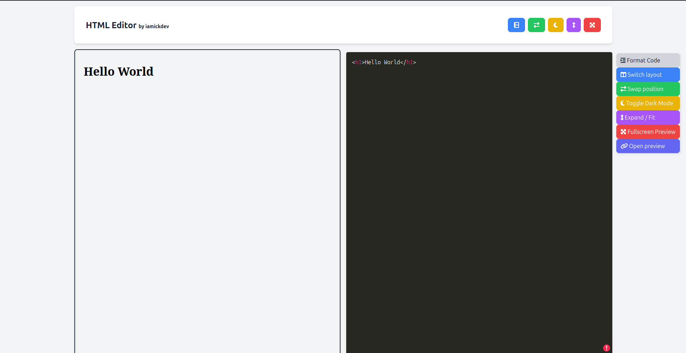

# HTML Live Editor and Previewer

   

A single-file HTML live editor and previewer with a simple and intuitive interface. Built with HTML and TailwindCSS

[Features](#-features) • [Todo](#-to-do-list) • [Contributing](#-contributing) • [Acknowledgments](#-acknowledgments) • [License](#-license)

## 🌟 Features

- 📋 Real-time preview for HTML
- 🎨 Syntax highlight support
- 📦 Export as HTML, Image

## 📝 TODO List

- [ ] Add markdown support
- [ ] Fix cursor position issue
- [ ] Add more themes
- [ ] Add more export options

## 🎉 Contributing

Contributions, issues, and feature requests are welcome! Feel free to check [issues page](https://github.com/arnonsang/html-live-editor/issues) or open [pull request](https://github.com/arnonsang/html-live-editor/pulls).

## 📄 License

This project is licensed under the MIT License - see the [LICENSE](LICENSE) file for details.

## 🙏 Acknowledgments

We'd like to tip our hats to:

- The awesome folks at **[favicon.io](https://favicon.io/favicon-generator/)** for their fantastic favicon generator. It's made our app look snazzy!

Your resources have been invaluable in making this project shine. Thank you! 🌟

## Author

Made with ❤️ by **[iamickdev](https://www.iamickdev.com)**
- Website: [www.iamickdev.com](https://www.iamickdev.com)
- Github: [@arnonsang](https://github.com/arnonsang)

---